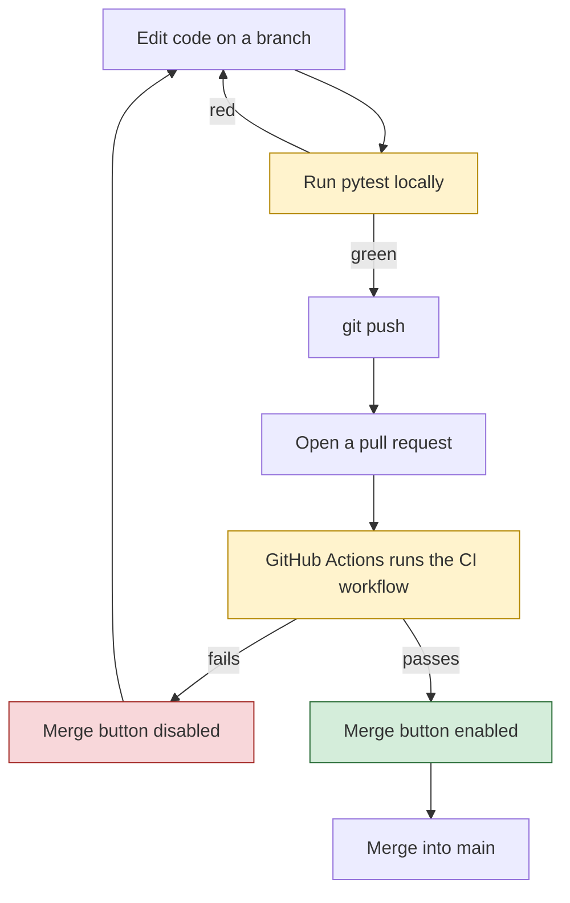
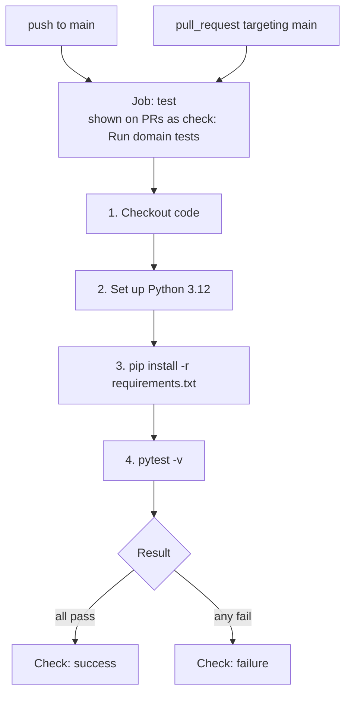
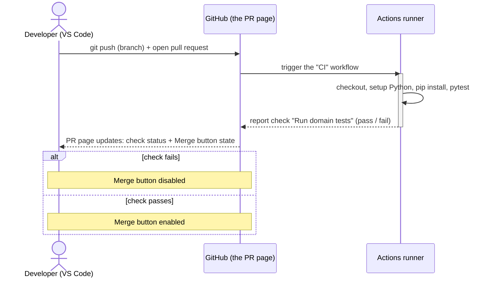
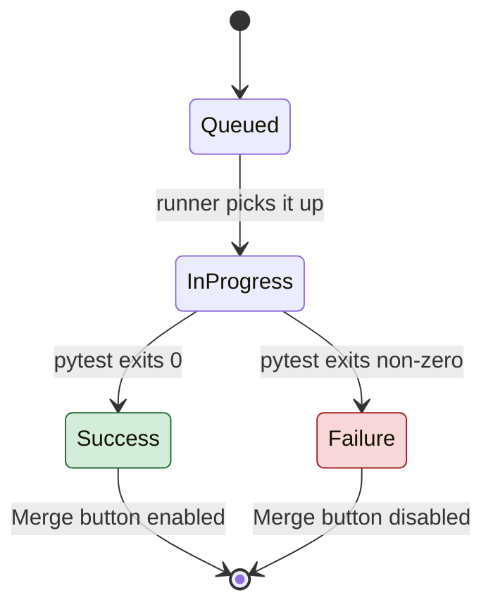
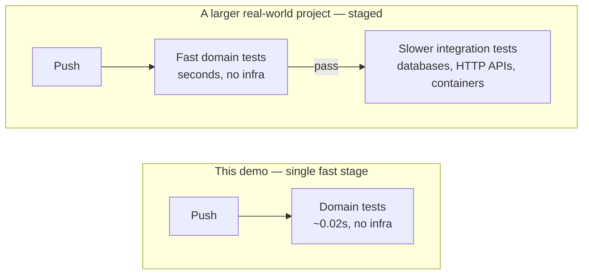

# Continuous Integration Walkthrough

This walkthrough has two parts: a live run-through of what a broken commit
looks like from the moment it's pushed to the moment GitHub stops it from
reaching `main`, and a follow-up exercise you can repeat on your own
afterwards, on your own copy of the repository.

Looking for a condensed, copy-paste-ready version of section 5 instead of
the fully explained one below? See [DEMO_SCRIPT.md](../DEMO_SCRIPT.md).

---

## 1. What this walkthrough shows

Underneath the stock-portfolio theme, this repository demonstrates four
ideas that show up in every professional software team:

1. **Automated tests** catch mistakes without a human having to notice them.
2. **A CI pipeline** (GitHub Actions, in this case) runs those tests
   automatically every time code is pushed — nobody has to remember to run
   them by hand.
3. **A pull request (PR)** is the normal way to propose a change to shared
   code, and it's the natural place to show the result of that automated
   check.
4. **A branch protection rule** turns "please don't merge broken code" from
   a polite request into something the platform enforces — the *Merge*
   button is physically disabled while the check is red.

None of this depends on the specific business logic in this repo. The
"stock portfolio" domain is just something concrete and small enough to
reason about; it could be a shopping cart, a payroll calculation, anything.

The loop we'll walk through, over and over, looks like this:



---

## 2. The domain model, in 60 seconds

Two classes, no framework, no database:

- **`Money`** (`portfolio_domain/money.py`) — an immutable amount of money,
  always rounded to 2 decimals. `Money.of(10).add(Money.of("2.50"))` gives
  you a new `Money` worth `12.50`.
- **`Portfolio`** (`portfolio_domain/portfolio.py`) — holds a cash balance
  and stock holdings. `buy(ticker, quantity, price)` spends cash and records
  shares; `sell(ticker, quantity, price)` releases shares, adds cash back,
  and returns the realized gain, consuming the oldest purchased shares
  first (FIFO — first in, first out).

Fifteen tests in `tests/` pin down this behavior: what a normal purchase
does, what happens if you try to buy more than you can afford, what happens
if you try to sell more shares than you own, and so on. You don't need to
read every test to follow along — just know that they run in
**0.02 seconds**, because there is no database, no network call, and no
web server involved. That speed is what makes the rest of this walkthrough
possible.

---

## 3. Prerequisites

| Tool | Notes |
|---|---|
| Python 3.9+ | Check with `python3 --version`. Any recent version works. |
| Git | Check with `git --version`. |
| VS Code | The built-in terminal is all that's needed; the Python extension is nice to have but not required. |
| A GitHub account | Needed before section 5: you'll fork the repo (see [6.1](#61-fork-the-repository)) and open pull requests from your own copy — you don't have push access to this repository directly. |
| [GitHub CLI](https://cli.github.com/) (`gh`) | Optional. Speeds up creating a pull request from the terminal (`gh pr create`) instead of the website. |

---

## 4. Repository tour

```
ci-demo-python/
  portfolio_domain/
    money.py        Money value object
    portfolio.py     Portfolio: deposit / buy / sell, FIFO lots
    exceptions.py    InsufficientFundsError, InsufficientSharesError
  tests/
    test_money.py
    test_portfolio.py
  .github/workflows/ci.yml   The pipeline definition itself
  requirements.txt            Just pytest
  pyproject.toml              Tells pytest where the tests and code live
```

The pipeline is defined in `.github/workflows/ci.yml`, and it's short
enough to read end to end:

```yaml
name: CI

on:
  push:
    branches: [main]
  pull_request:
    branches: [main]

jobs:
  test:
    name: Run domain tests
    runs-on: ubuntu-latest
    steps:
      - name: Checkout code
        uses: actions/checkout@v4

      - name: Set up Python
        uses: actions/setup-python@v5
        with:
          python-version: "3.12"

      - name: Install dependencies
        run: pip install -r requirements.txt

      - name: Run tests
        run: pytest -v
```

In plain English: every time someone pushes to `main`, or opens/updates a
pull request targeting `main`, GitHub spins up a fresh Ubuntu machine,
checks out the code, installs Python 3.12, installs `pytest`, and runs the
test suite. That's the entire pipeline — no deployment step, no
infrastructure. This is CI (Continuous **Integration**), not CD (Continuous
**Deployment**).



The job is named `Run domain tests`. That exact name is what a **branch
protection rule** on `main` requires to pass before a pull request can be
merged. The rule lives at:

```
https://github.com/<owner>/ci-demo-python/settings/branches
```

It requires:
- The `Run domain tests` check to pass.
- The branch to be up to date with `main` before merging (this matters —
  see the troubleshooting section if a check looks green but the PR still
  won't merge).
- This applies to **everyone**, including repository administrators — there
  is no bypass.

---

## 5. Live walkthrough: breaking the build on purpose

> **Before continuing:** fork this repository and clone your fork — see
> [6.1 Fork the repository](#61-fork-the-repository) and
> [6.2 Clone your fork](#62-clone-your-fork) below — then run every command
> in this section inside your fork. Cloning `alfredorueda/ci-demo-python`
> directly won't let you push a branch or open a pull request.

The best way to understand a CI pipeline is to watch it catch something.
Here's the mental model before diving in — three actors, one round trip:



The only thing that changes between a failing run and a passing run is
whether that last message back to GitHub says "pass" or "fail" — everything
else in the diagram happens identically either way.

### 5.1 Starting point

We start from a clean `main` branch, where all 15 tests pass:

```bash
git checkout main
git pull
pytest -v
```

`15 passed`, in a fraction of a second — no Docker, no database, no network
call. That speed is what makes the rest of this walkthrough possible: a
slow test suite would make this whole loop painful enough that people stop
running it.

### 5.2 Creating a branch and introducing a bug

```bash
git checkout -b break-the-build
```

Open `portfolio_domain/portfolio.py` and find the `buy` method:

```python
def buy(self, ticker: str, quantity: int, price: Money) -> None:
    cost = price.multiply(quantity)
    if cost.amount > self._cash.amount:
        raise InsufficientFundsError(
            f"Cannot buy {quantity} {ticker}: cost {cost} exceeds cash balance {self._cash}"
        )
    self._cash = self._cash.subtract(cost)          # <-- comment out this line
    self._lots.setdefault(ticker, deque()).append(_Lot(quantity, price))
```

Comment out the highlighted line, so buying shares no longer deducts the
cost from the cash balance — a realistic, relatable bug: forgetting to
update a balance after a transaction.

Running the tests locally, **before pushing anything**, already shows the
problem:

```bash
pytest -v
```

```
2 failed, 13 passed
```

The two failures are `test_buy_deducts_cash_balance` and
`test_sell_increases_cash_balance` — one small bug broke two different
behaviors, which is exactly why a suite covers more than one scenario
instead of a single happy path.

### 5.3 Pushing the branch and opening a pull request

```bash
git add -A
git commit -m "Introduce a bug on purpose for the CI demo"
git push -u origin break-the-build
```

Open a pull request against `main`:

- On the website: click the "Compare & pull request" banner GitHub shows
  after the push, or go to the repository's **Pull requests** tab → **New
  pull request**.
- From the terminal, with `gh` installed: `gh pr create --fill`.

This is the moment where, in a real team, this change would be shared for
review. Notice it wasn't pushed straight to `main` — the branch protection
rule wouldn't have allowed that anyway.

### 5.4 Watching the check fail

On the pull request page, the check goes through three states, and only
one of them lets the PR merge:



Right after opening the PR, the check shows a yellow dot (queued / in
progress) next to `Run domain tests` — GitHub is spinning up a fresh
virtual machine for it, which usually takes 10–20 seconds. A refresh turns
it into a red ✕.

Clicking **Details** next to the failed check opens the Actions log, with
the same `pytest` output that showed up locally a moment ago. CI didn't
find something new here — it just proved, automatically and visibly to
everyone with access to the repository, what already showed up on one
machine.

At the bottom of the PR, the **Merge** button is greyed out, with a message
like *"Merging is blocked — Required statuses must pass before merging."*
That's not a suggestion: nobody — not even a repository administrator — can
merge this pull request until the check turns green.

### 5.5 Fixing it and watching it go green

Back in the editor, uncomment the line that was disabled:

```python
self._cash = self._cash.subtract(cost)
```

```bash
pytest -v          # confirm 15 passed, locally, before pushing
git add -A
git commit -m "Fix the cash balance bug"
git push
```

On the pull request page, the check reruns, turns yellow then green, and
the **Merge** button becomes active. Merging it (`Squash and merge` is a
reasonable default) closes the loop.

### 5.6 What this shows

- The full loop — write code, get automatic feedback, fix, merge — took a
  few minutes **only because the test suite is fast and has no
  infrastructure to spin up.** A slow suite (databases, containers,
  external services) trains people to stop waiting for it, which is exactly
  how bugs like this one slip into `main` on real projects.
- Branch protection turns *"please run the tests before merging"* — a
  request people forget under deadline pressure — into *"you cannot merge
  until they pass"* — a rule the platform enforces, with no exceptions.
- Everything above is defined as code, in `.github/workflows/ci.yml`. It's
  reviewed, versioned, and changed through pull requests exactly like the
  application code it tests.

---

## 6. Try it yourself

This section reproduces everything above on your own copy of the
repository, so nothing here can affect anyone else. It takes about
15–20 minutes. Already forked and cloned before section 5? Skip ahead to
[6.3](#63-set-up-the-environment-and-confirm-the-baseline-is-green).

### 6.1 Fork the repository

1. Go to `https://github.com/<owner>/ci-demo-python`.
2. Click **Fork** (top-right corner). This creates a full copy of the
   repository under your own GitHub account, e.g.
   `https://github.com/<your-username>/ci-demo-python`.

### 6.2 Clone your fork

Open a terminal (or the VS Code terminal) and run, replacing
`<your-username>`:

```bash
git clone https://github.com/<your-username>/ci-demo-python.git
cd ci-demo-python
```

### 6.3 Set up the environment and confirm the baseline is green

macOS / Linux:

```bash
python3 -m venv .venv
source .venv/bin/activate
pip install -r requirements.txt
pytest -v
```

Windows (PowerShell):

```powershell
python -m venv .venv
.venv\Scripts\Activate.ps1
pip install -r requirements.txt
pytest -v
```

`15 passed`, in well under a second. If not, see
[Troubleshooting](#8-troubleshooting--faq) before continuing.

### 6.4 Turn on branch protection on the fork

Forking copies the code, but **not** the branch protection rule — that
needs to be set up again to see the "merge blocked" behavior on the fork:

1. On the fork, go to **Settings → Branches**.
2. Click **Add branch protection rule** (or **Add rule**).
3. Under "Branch name pattern", type `main`.
4. Enable **Require status checks to pass before merging**.
5. In the search box, find and select **Run domain tests**. If it doesn't
   appear yet, push a commit first — a check only becomes searchable after
   it has run at least once on the fork — then come back to this step.
6. Enable **Do not allow bypassing the above settings** (the equivalent of
   "include administrators" — it makes the rule apply to the fork's owner
   too, not just to other contributors).
7. Click **Create** (or **Save changes**).

### 6.5 Repeating the break → PR → fix loop

Follow the same steps as [section 5.2 through 5.5](#52-creating-a-branch-and-introducing-a-bug),
on the fork:

1. `git checkout -b break-the-build`
2. Comment out the cash-deduction line in `portfolio_domain/portfolio.py`.
3. Run `pytest -v` locally — confirm 2 failures.
4. Commit, push, open a pull request against the fork's own `main`.
5. Watch the check fail, look at the log, notice the disabled **Merge**
   button.
6. Uncomment the line, run `pytest -v` locally to confirm 15 pass, commit,
   push again.
7. Watch the check turn green and merge the pull request.

### 6.6 A few things worth trying afterwards

Not required, but they build real intuition:

- **Break a different test on purpose.** Try changing the FIFO order in
  `sell` (swap `lots[0]` for `lots[-1]`) and see which test catches it.
- **Add a brand new test.** Write a test for a scenario that isn't covered
  yet — e.g. selling shares from three different lots in one call — and
  watch it run automatically on the next push, with zero extra
  configuration.
- **Push directly to the fork's `main`.** With branch protection on, even
  a direct push (not through a PR) gets rejected — the same rule at work
  from a different angle.
- **Temporarily disable the branch protection rule** (Settings → Branches
  → delete or edit the rule), then repeat the broken-test scenario. The
  check still turns red — but now the **Merge** button stays active. This
  separates two ideas that are easy to conflate: *running tests
  automatically* and *enforcing that they must pass* are two different
  features, and this just turned one of them off.

---

## 7. Glossary

| Term | Meaning here |
|---|---|
| **Repository (repo)** | The project's folder, tracked by Git, hosted on GitHub. |
| **Commit** | A saved snapshot of changes, with a message describing them. |
| **Branch** | An independent line of work, starting from some point in the project's history — lets changes happen without touching `main` until they're ready. |
| **Pull request (PR)** | A request to merge one branch into another (usually into `main`), with a page on GitHub where the diff, comments, and checks are shown. |
| **CI (Continuous Integration)** | Automatically building and testing every change, on every push, instead of relying on someone remembering to do it. |
| **Workflow** | A pipeline definition file, here `.github/workflows/ci.yml`. |
| **Job / step** | A workflow is made of jobs; each job is made of steps run in order. This repo has one job (`test`) with four steps. |
| **Status check** | The pass/fail result of a job, shown directly on a pull request. |
| **Branch protection rule** | A GitHub setting on a specific branch (here, `main`) that can require checks to pass, forbid force-pushes, etc., before a change is allowed in. |
| **Merge blocked** | The state where a pull request cannot be merged because a required condition (here, the `Run domain tests` check) hasn't been satisfied yet. |

---

## 8. Troubleshooting / FAQ

**The check has been "Queued" for a while.**
GitHub-hosted runners can take anywhere from a few seconds to about a
minute to start, especially at busy times. Refresh the page; there's
nothing to fix.

**The check is green, but the Merge button is still disabled.**
This branch protection rule uses a *strict* status check, meaning the
branch must also be up to date with the latest `main` before merging (not
just passing on its own). GitHub shows an **Update branch** button on the
PR — click it, wait for the check to re-run on the updated code, and the
Merge button becomes available.

**`pytest` isn't found.**
The virtual environment probably isn't active. Re-run `source
.venv/bin/activate` (macOS/Linux) or `.venv\Scripts\Activate.ps1`
(Windows) from section 6.3, then try again. It worked if the terminal
prompt shows `(.venv)` at the start of the line.

**The workflow never runs at all after a push.**
Check that the push went to a branch with a PR opened **against `main`**
(or straight to `main`) — the workflow only triggers on those events (see
the `on:` block in `.github/workflows/ci.yml`). Also double-check the file
is still at exactly `.github/workflows/ci.yml` — GitHub Actions only looks
in that folder.

**A push straight to `main` gets rejected.**
That's the branch protection rule working as intended — direct pushes to a
protected branch are exactly what it's designed to stop. Create a branch
and open a pull request instead (see section 6.5).

---

## 9. Where to go from here (optional, beyond this walkthrough)

This repository intentionally keeps everything at one speed — pure domain
logic, no infrastructure. In a real project, tests usually end up in two
tiers: fast, infrastructure-free tests like these, and slower integration
tests that talk to a real database or API. A common next step is a
**staged pipeline**: a fast job that runs on every single push for instant
feedback, followed by a slower job — using `needs:` in the workflow file —
that only runs once the fast one has passed, or only on merges into `main`.



The same idea, applied to a much larger, production-shaped codebase, is
worth exploring once this smaller version feels familiar.
